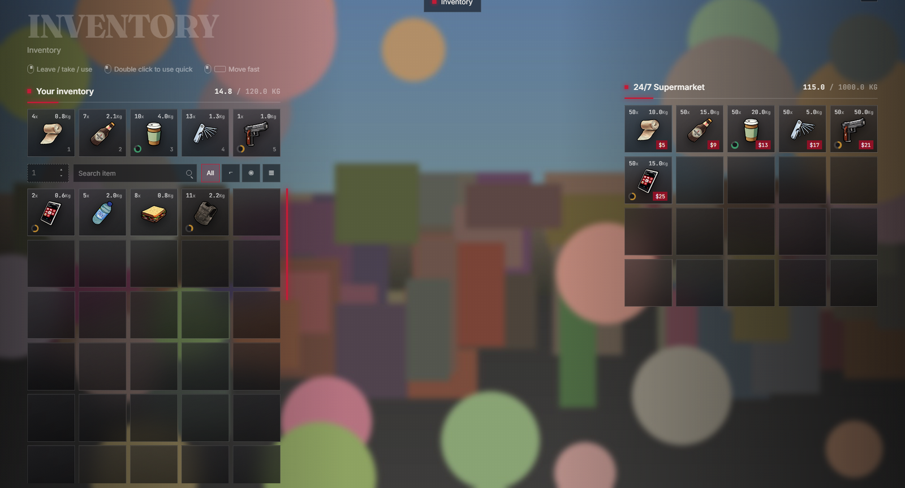
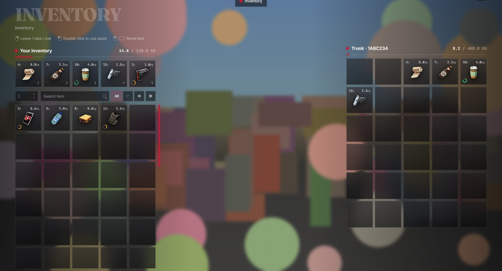
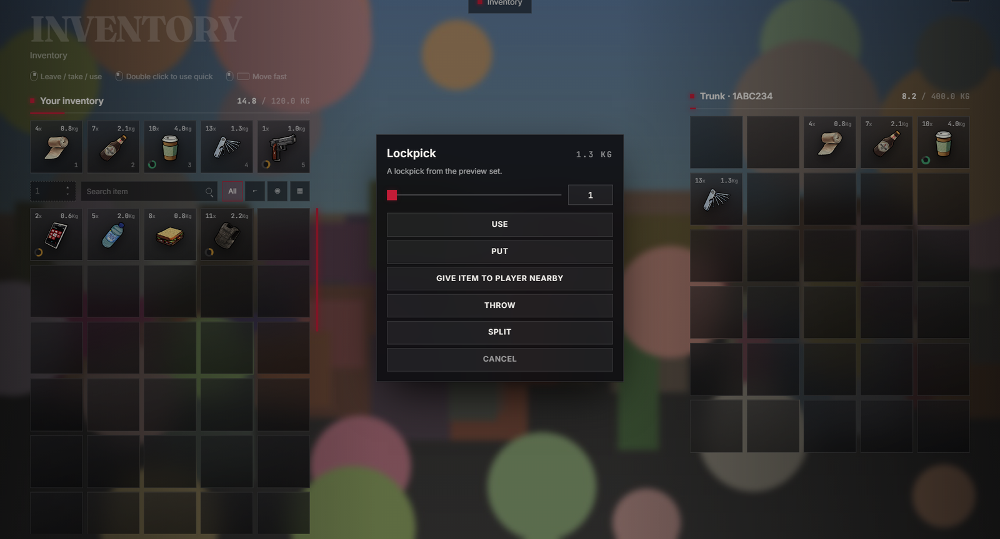
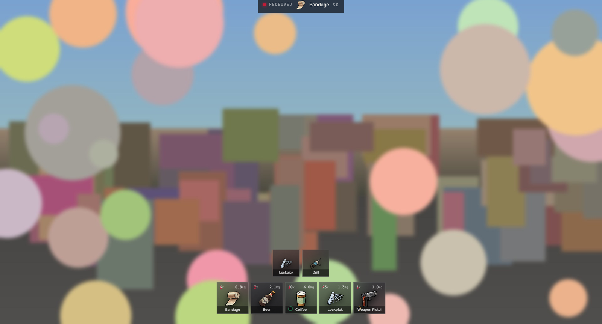

# lx-inventory — qb-inventory with the LXR interface

    

The qb-inventory 2.x you already run, with its interface rebuilt on the **LXR UI kit** in the tgiann composition: inventory at the left edge, the other inventory at the right, your character visible in the middle; a 5-slot fast row, amount stepper, search and category filters; big frosted tiles that show count and weight; a centered action sheet with an amount slider. Everything scales in `vh`, one blood accent, radius 0. No Vue, no axios, no icon fonts, no CDN — the fonts ship inside the resource, so it renders with the server offline. The Lua side is untouched; every message and callback keeps its payload.

Free, from **The Lux Empire · LXRCore** — https://www.lxrcore.com · https://github.com/LXRCore

---

| Shop | Stash |
|---|---|
|  |  |
| **Context menu + tooltip** | **HUD — hotbar, item box, required items** |
|  |  |

## What you get

* **Left**: the INVENTORY wordmark, mouse hints, *Your inventory* with the weight underline, the **5 fast slots**, then amount stepper · search · filters and the grid with the accent bar. **Right**: whatever you opened (stash, trunk, glovebox, drop, another player, shop). **Middle**: your character.
* **Tiles**: `4x` count and `0.8Kg` weight in the corners, the image, a **durability ring** bottom-left, slot number on the fast row, shop price in red. Non-matching tiles dim when you search or filter.
* **Drag & drop** with a ghost and a glowing target; stack, swap, partial move by the stepper amount; drag out of the panel to throw on the ground.
* **Right-click** opens the action sheet: Add to fastslot · Use · Put · Give item to player nearby · Throw · Split · Copy serial · Attachments · Cancel, with a slider for how many.
* **Tooltip** with description, info fields and durability; **weapon attachments** panel (click to take one off).
* **HUD layer**: 5-slot hotbar, the item box (`RECEIVED · USED · REMOVED`), the required-items strip.
* Error shake + the drop-fail sound on refused moves; `ESC` / `TAB` close.

## Install

1. Drop the folder into `resources/[qb]` (or anywhere). The folder may be called `lx-inventory` or `qb-inventory` — the NUI reads the name with `GetParentResourceName()`.
2. Fresh install: import `qb-inventory.sql`. Coming from the old qb-inventory: import `qb-inventory.sql`, then run `migrate.sql` once to move stash / trunk / glovebox rows into `inventories`, then drop `gloveboxitems`, `stashitems`, `trunkitems`.
3. `ensure lx-inventory` after `qb-core` (and after `qb-weapons`, which it depends on).
4. Keep your item images in `html/images/` as before.

Dependencies: [qb-core](https://github.com/qbcore-framework/qb-core), [qb-weapons](https://github.com/qbcore-framework/qb-weapons), [qb-smallresources](https://github.com/qbcore-framework/qb-smallresources) for logging.

## Controls

| Action | Input |
|---|---|
| Move / stack / swap | drag a tile (the **amount** stepper limits how many) |
| Action sheet (use · add to fastslot · put · give · throw · split · serial · attachments) with an amount slider | right-click |
| Buy one in a shop | right-click the shop item |
| Use | double-click |
| Move fast to the other panel · split a stack (single panel) | shift-click |
| Find an item | the search box, or the All · weapons · usable · other filters (non-matching tiles dim) |
| Close | `ESC` · `TAB` |

## For developers

**Contract** — unchanged from qb-inventory 2.x, so anything that talks to `qb-inventory:client:*` keeps working:

* messages in: `open` · `close` · `update` · `toggleHotbar` · `itemBox` · `requiredItem`
* callbacks out: `CloseInventory` · `SetInventoryData` · `UseItem` · `DropItem` · `GiveItem` · `AttemptPurchase` · `PlayDropFail` · `GetWeaponData` · `RemoveAttachment`

**Files** — `html/index.html` (markup), `html/main.css` (inventory rules; every colour, face and spacing is a kit token), `html/app.js` (vanilla JS, ~330 lines), `html/lxr-ui.css` (the kit), `html/fonts/` (Fraunces · Inter · JetBrains Mono · Noto Sans Georgian).

**Restyle** — change tokens, not rules: the accent is `--lxr-blood` / `--lxr-blood-lit`, surfaces are `--lxr-void` / `--lxr-pit` / `--lxr-edge`, text is `--lxr-bone` / `--lxr-ash` / `--lxr-smoke`. The kit also ships a `morning` theme (`:root[data-theme='morning']`).

**Preview without the game** — `python -m http.server 8766` in the resource folder, open `http://127.0.0.1:8766/tests/preview.html`. The buttons fire the same messages the client sends; `?mode=test` runs the interaction test (partial drag, stack, swap, quick move, split, purchase, menu, drop) and prints the callback payloads into `<pre id="result">`.

## Credits and licence

qb-inventory by the [QBCore Framework](https://github.com/qbcore-framework) — GPL-3.0. Interface by iBoss21 / LXRCore, same licence. The LXR UI kit is part of [LXRCore](https://github.com/LXRCore) (LXRCore Framework License v1.0).
